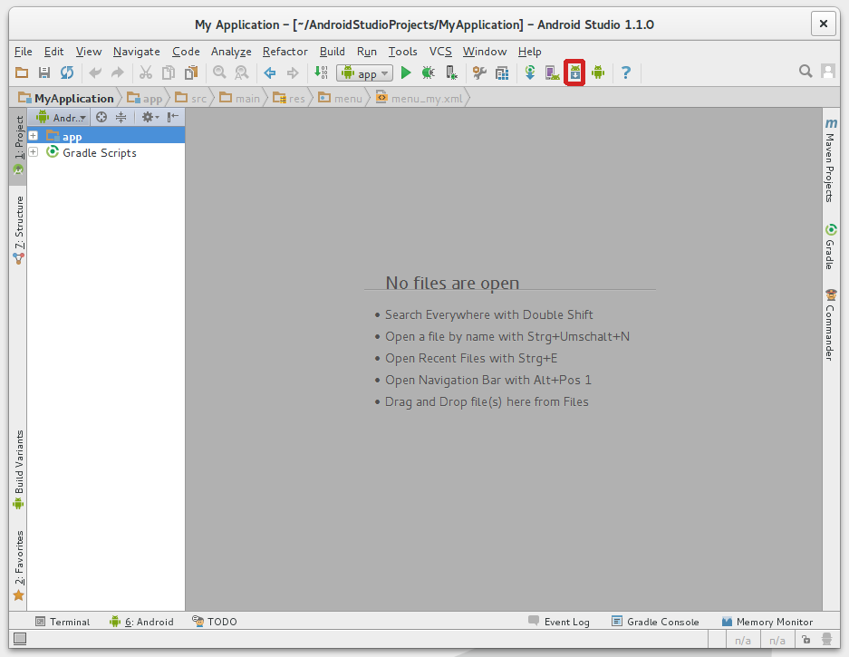

## Installing Java

```
sudo add-apt-repository ppa:webupd8team/java
sudo apt-get update
sudo apt-get install oracle-java8-installer
```

After that,
```
sudo apt-get install oracle-java8-set-default
```

---
## Installing Android Studio

1. Download Android Studio from [here](https://developer.android.com/sdk/index.html), use All Android Studio Packages
2. Extract the archive file into an appropriate location for your applications, eg: ```/opt.``` Use the filename of your downloaded archive, in my example ```android-studio-ide-141.2178183-linux.zip```
```
sudo unzip android-studio-ide-141.2178183-linux.zip -d /opt
```
3. To launch Android Studio, navigate to the ```/opt/android-studio/bin``` directory in a terminal and execute ```./studio.sh```. Or use a desktop file, see below.

You may want to add ```/opt/android-studio/bin``` to your PATH environmental variable so that you can start Android Studio from any directory.

---
## Create a desktop file

Create a new file ```androidstudio.desktop``` by running the command:
```
nano ~/.local/share/applications/androidstudio.desktop
```
and add the lines below
```
[Desktop Entry]
Version=1.0
Type=Application
Name=Android Studio
Exec="/opt/android-studio/bin/studio.sh" %f
Icon=/opt/android-studio/bin/studio.png
Categories=Development;IDE;
Terminal=false
StartupNotify=true
StartupWMClass=android-studio
```

---
## Installing Android SDK (if necessary)

1. Click the marked button


2. Get the latest SDK tools
As a minimum when setting up the Android SDK, you should download the latest tools and Android platform:
    1. Open the Tools directory and select:
        * Android SDK Tools
        * Android SDK Platform-tools
        * Android SDK Build-tools (highest version)
    2. Open the first Android X.X folder (the latest version) and select:
        * SDK Platform
        * A system image for the emulator, such as ARM EABI v7a System Image

3. Get the support library for additional APIs

The Android Support Library provides an extended set of APIs that are compatible with most versions of Android.

Open the ```Extras``` directory and select:
* Android Support Repository
* Android Support Library

4. Get Google Play services for even more APIs

To develop with Google APIs, you need the Google Play services package:

Open the ```Extras``` directory and select:
* Google Repository
* Google Play services

5. Install the packages

Once you've selected all the desired packages, continue to install:
* Click ```Install X``` packages.
* In the next window, double-click each package name on the left to accept the license agreement for each.
* Click ```Install```