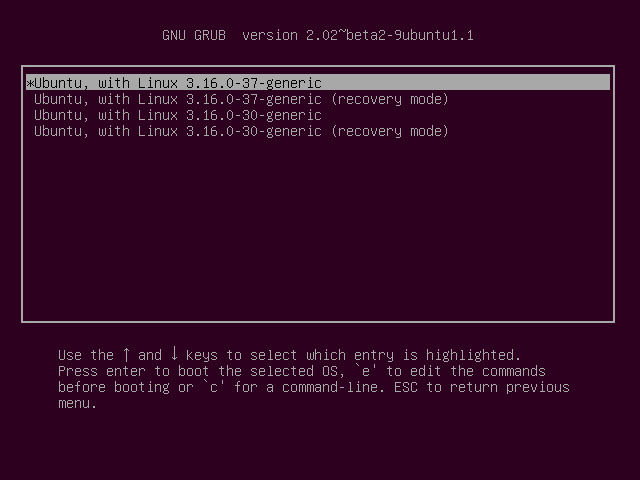
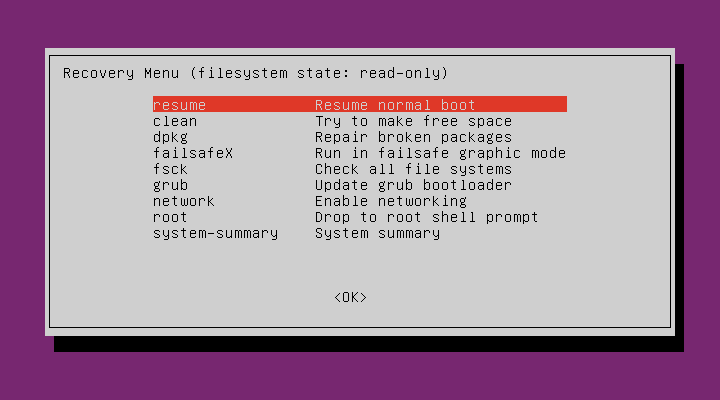

**By default the first user's account is an administrative account, so if the UI is prompting you for a password it's probably that person's user password. If the user doesn't remember their password you need to reset it. To do this you need to boot into recovery mode.**

Boot up the machine, and after the BIOS screen, hold down the left **`Shift`** key. You will then be prompted by a menu that looks something like this:

I've noticed on some systems that timing when to hit the left Shift key can be tricky, sometimes I miss it and need to try it again.

Hit the down arrow until you select the 2nd entry from the top (the one with the recovery mode in the description) and then hit Enter.

Now you should see this menu:

Using the arrow keys scroll down to either root and then hit Enter.

You should now see a root prompt, something like this:

        root@ubuntu:~#
At this stage you should have a read-only filesystem. You have to remount it with write permissions:

        mount -rw -o remount /
Now we can set the user's password with the passwd command. (In this example I will use jorge as the example, you need to substitute whatever the user's username is):

    root@ubuntu:~# passwd 
    Enter new UNIX password:
    Retype new UNIX password:
    passwd: password updated successfully
    root@ubuntu:~#

Type in what you want the new password to be at the prompt. After it's successful reboot the machine and the user will be able to log in with their new password.

* [Recovery Mode](https://wiki.ubuntu.com/RecoveryMode) documentation.
* [Lost password](https://help.ubuntu.com/community/LostPassword) documentation.

